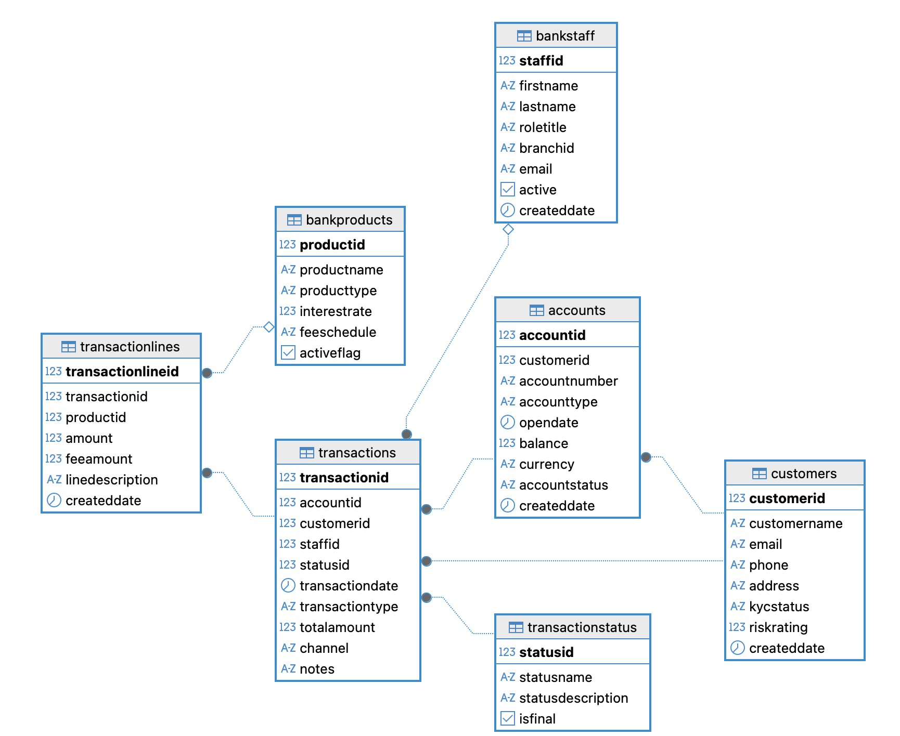
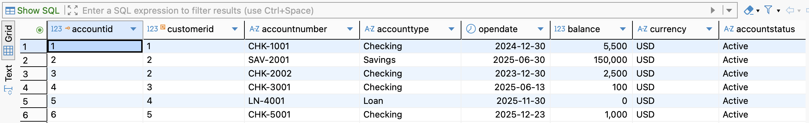
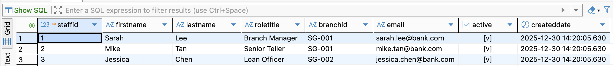
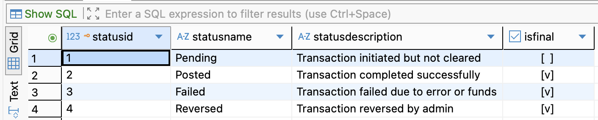
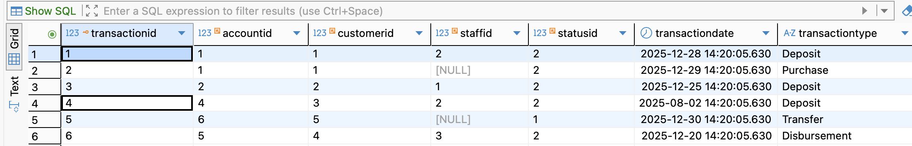

# IWC423 Advanced Database Systems Team 1 Notes

## Members

* Tan Le Xuan
* Gabriel Ong Zhe Mian
* Luke Nathaniel Teo Bo Sheng

## Code files

### 24/12/25: Module 1

* Assigned to create a schema for the banking domain.

### 25/12/25: Module 2

* Generated ER Diagram with [DBeaver](https://dbeaver.io/)
* [population.sql](./../sql/population.sql)
* [module_2.sql](./../sql/module_2.sql)

### 26/12/25: Module 3

* **Business logic for bank**
    1. *Fraud detection*: Set maximum limits on each transaction 
    2. *Recommend customer financial plans*: If customer's account has high balance, suggest suitable bankProducts catered 
    3. *Follow-up on inactive accounts*: If customer's account has been inactive for a set period (determined per opening date), follow up via phone/email and offer more attractive bankProducts to reduce churn
* [module_3_fraud_detection.sql](./../sql/module_3_fraud_detection.sql)
* [module_3_high_account_balance.sql](./../sql/module_3_high_account_balance.sql)
* [module_3_inactive_account_followup.sql](./../sql/module_3_inactive_account_followup.sql)

### 29/12/25: Module 4

* **SQL Joins**
    1. Show Customers with their Accounts 
    2. Total number of Transactions per Account
    3. Total Transaction value per Customer
    4. Customers with more than one Account
    5. Average fee per BankProduct
* [module_4.sql](./../sql/module_4.sql)

### 30/12/25: Module 5

* Created diagram for horizontal and vertical sharding/partitioning.

### 31/12/25: Module 6

* Assigned to implement database security designs for our banking domain. 

### 02/01/26: Module 7

* **NoSQL strategy**
* Chose a suitable dataset from KAGGLE and a respectively suitable database. Assigned to explain the risks and challenges associated with using the database for the business. 

### 03/01/26: Module 8

* Decided on and scripted out a long-tail marketing strategy for our team's project within the banking domain.
* Created `.json` files for each team member [here](./../json/)

### 05/01/26: Module 9

* Attempted sample MongoDB scripts for the provided exercise A-F within the slides
* Added summary writeup for tasks completed during the lesson

### 06/01/26: Module 10

* Attempted sample MongoDB scripts for the provided exercise A-E within the slides
* Added writeup for application of MongoDB to our specific banking domain, as well as tradeoffs between traditional relational PostGreSQL ORM and MongoDB's NoSQL setup

### 07/01/26: Module 11

* Added a detailed writeup on the below 3 areas for our banking domain example
    1. *Part 1*: Analytical, Storage and Infrastructure Technologies for your Team Project 
    2. *Part 2*: Database integration approach
    3. *Part 3*: Approach to improving p95 for a 5-second response time 